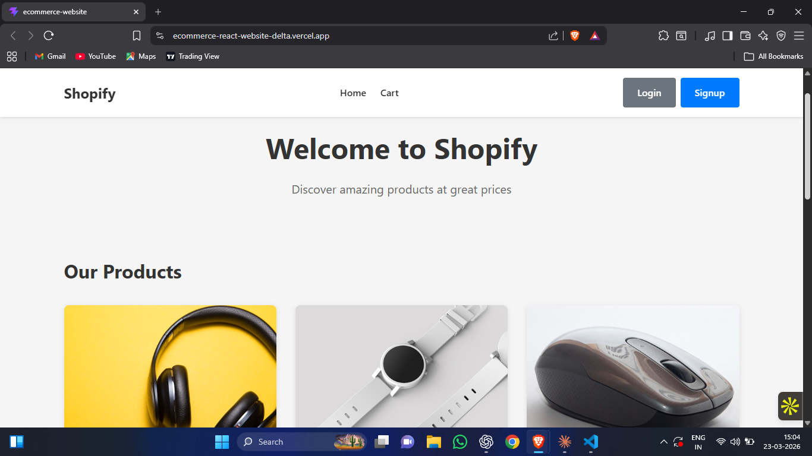
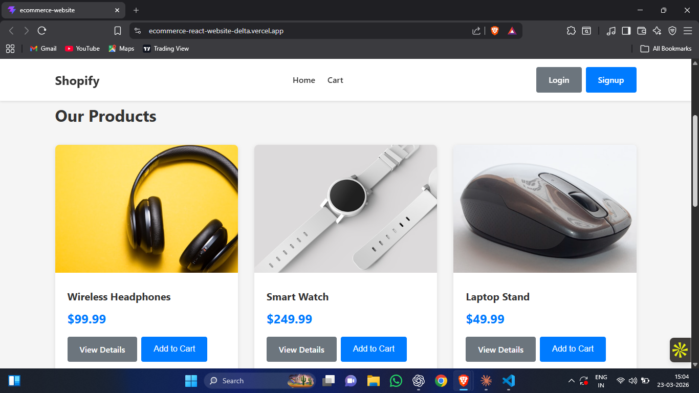
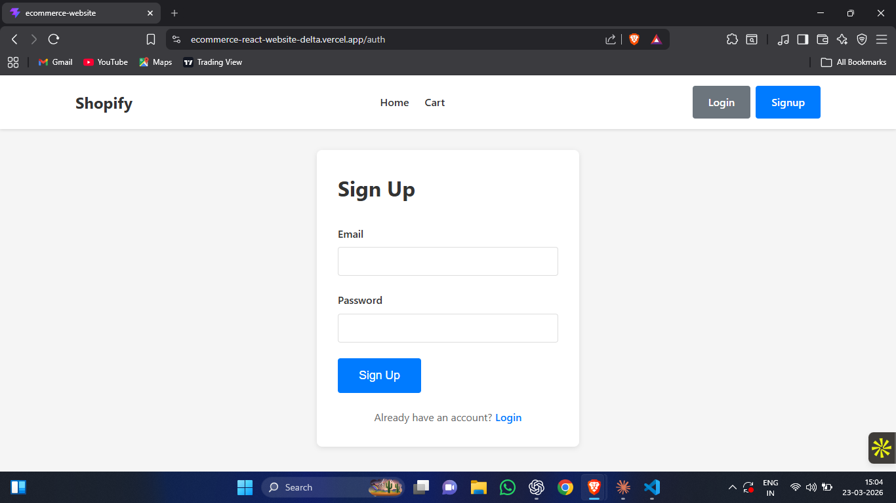
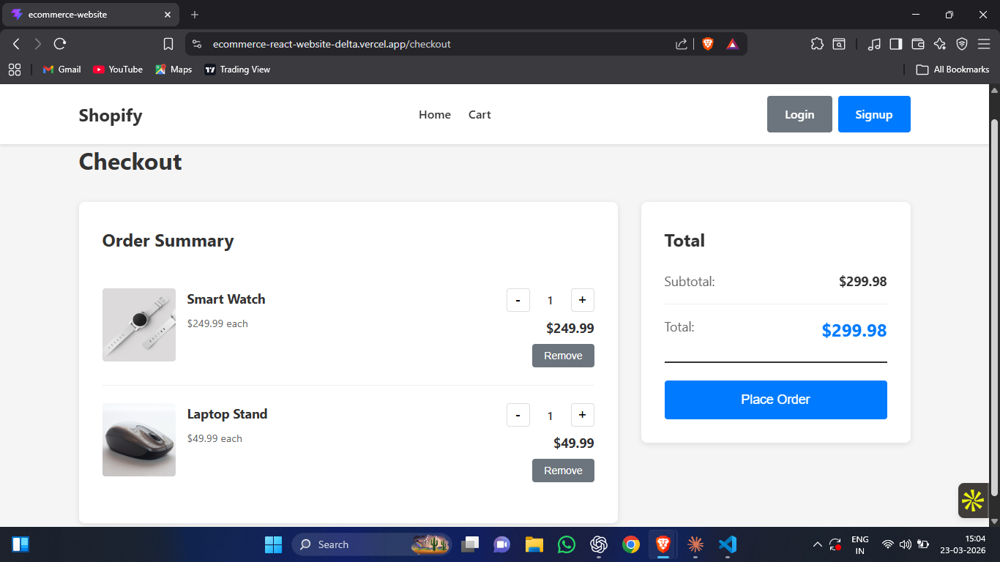

# 🛍️ E-Commerce React Website

A modern and responsive **E-Commerce web application** built using React.
The project demonstrates a clean UI, product browsing experience, and a simple checkout flow.

🌐 **Live Demo:**
https://ecommerce-react-website-delta.vercel.app/
    
---   
    
## ✨ Features   

* 🛒 Browse products in a clean catalog layout
* 🔐 User authentication (Login / Signup)
* 🧾 Checkout page for order review
* 📱 Fully responsive design
* ⚡ Fast performance with React

---

## 🛠️ Tech Stack

**Frontend**

* React
* JavaScript
* HTML5
* CSS3

**Deployment**

* Vercel

---

## 📸 Screenshots

### 🏠 Homepage



### 🛍️ Items Page



### 🔐 Login / Signup Page



### 💳 Checkout Page



---

## ⚙️ Installation

### Clone the repository

```
git clone https://github.com/vanshhg/ecommerce-react-website.git
```

### Navigate into the project

```
cd ecommerce-react-website
```

### Install dependencies

```
npm install
```

### Run development server

```
npm start
```

Open in browser:

```
http://localhost:3000
```

---

## 📚 What I Learned

* Building reusable React components
* Managing UI layout and styling
* Creating responsive web pages
* Deploying React apps with Vercel

---

## 👨‍💻 Author

**Vansh Gangwal**

GitHub:
https://github.com/vanshhg

---

⭐ If you like this project, consider giving it a star!
